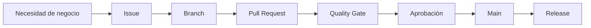

# Consulting Delivery Hub — Demo GitHub para Consultoría

Demo tangible para mostrar cómo una consultoría puede usar GitHub como **sistema de gobierno de productos digitales**, no solo como almacén de código.

## Qué demuestra

- Requerimientos de negocio estandarizados con **Issues**.
- Cambios controlados con **branches + Pull Requests**.
- Calidad automática con **GitHub Actions**.
- Versiones identificables con **Releases / Changelog**.
- Documentación funcional y técnica dentro del producto.
- Caso aplicado al seguimiento de compromisos de **FlowInvent / GEI**.

## Demo visual

La aplicación muestra:
- KPIs ejecutivos de implementación.
- Compromisos por Mercadeo, Abastecimiento, Operaciones y Ventas.
- Filtros por área y estado.
- Trazabilidad Issue → PR → CI → Release.
- Formulario de nueva solicitud para explicar cómo nace un requerimiento.

## Ejecutar localmente

```bash
npm test
npm run serve
```

Abrir `http://localhost:8080`.

## Flujo de trabajo



## Estructura

```text
.
├── .github/
│   ├── ISSUE_TEMPLATE/
│   ├── workflows/
│   ├── CODEOWNERS
│   └── PULL_REQUEST_TEMPLATE.md
├── data/actions.json
├── docs/
│   ├── architecture.md
│   ├── business-case.md
│   ├── demo-script.md
│   ├── flowinvent-mapping.md
│   └── governance.md
├── src/
│   ├── app.js
│   └── styles.css
├── tests/app.test.mjs
├── CHANGELOG.md
├── CONTRIBUTING.md
├── SECURITY.md
├── index.html
└── package.json
```

## Cómo convertirlo en una demo real en GitHub

1. Crear un repositorio vacío, preferiblemente privado para trabajo interno o público si será una demo comercial sin datos sensibles.
2. Subir este contenido a `main`.
3. Activar GitHub Pages con **GitHub Actions** como fuente.
4. Crear un Issue usando la plantilla “Solicitud de negocio”.
5. Crear una rama `feature/issue-<n>-...`.
6. Hacer un cambio, abrir PR y observar `Quality Gate`.
7. Aprobar, mergear y crear Release.
8. Mostrar al cliente el historial completo como evidencia.

## Mensaje comercial

> “No entregamos solo software. Entregamos productos digitales gobernados: cada requerimiento, decisión, cambio, validación y versión queda trazable y transferible al cliente.”

## Nota de seguridad

Los datos incluidos son demostrativos. No incluir credenciales, tokens, información personal ni datasets productivos del cliente en el repositorio.
