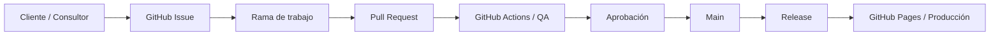

# Arquitectura del demo

La aplicación es deliberadamente estática para que el concepto pueda demostrarse sin infraestructura adicional. En un proyecto real, la misma gobernanza puede envolver soluciones React, Supabase, APIs, SQL, Tableau, Power BI, automatizaciones u otros componentes.
